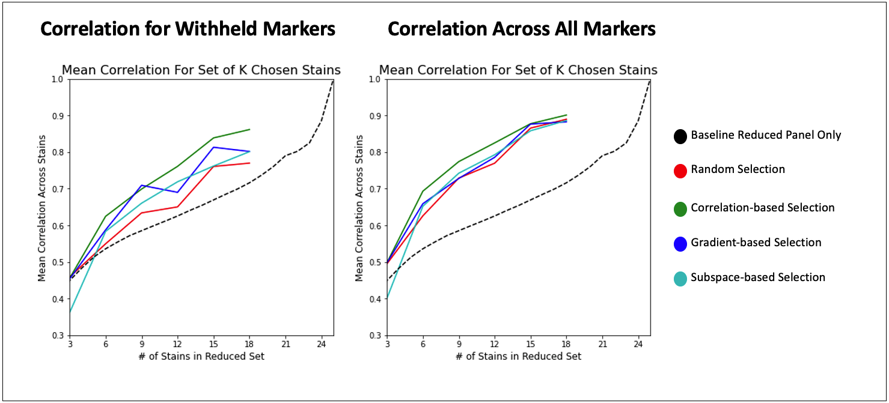

# Reduced Panel Selection 
Despite the increased panel sizes that multiplex imaging enables, they are still limited by practical capacities at high rounds of staining that reduce image quality. For this reason it is necessary to choose panels intelligently such that the most biological information is obtained. Designing such panels, however, is difficult becuase it isn't always possible to know which markers will be informative and which will be reduceable ahead of time. Here I present a series of methods that were tested for quantitatively selecting a reduced panel which can then be used to reconstruct the full panel, such that the maximum amount of information is retained.

  **Example workflow 1) Implementing methods for panel selection 2) Full panel reconstruction using ME-VAE 3) Quantitative evaluation.**

 

  

 

## Selection Methods
1) Correlation-based Selection: a reduced panel is chosen such that the correlations between the sub-panel and the full panel are maximized.
2) Gradient-based Selection: an ME-VAE is trained to embed and reconstruct the full panel. Then using the gradient at the embedding layer, the most important stains are selected.
3) Sparse Subspace Clustering: a coefficient matrix is trained such that the intensites of the panel can be reconstructed from a combination of other stains. Then the stains with the highest interactions are selected.

## Results
By using these methods for selection and the [ME-VAE](https://github.com/GelatinFrogs/ME-VAE_Architecture) for reconstruction, information regarding the full panel can be maximized. This allows researchers to enable better analysis using fewer stains. This saves time, money, and effort in multiplex experiments, and makes room on panels for potentially new and important markers that couldn't be fit before.

  **Correlations between full and reconstructed cell images for each selection method over a series of panel sizes.**

 

  

 

## Pre-requisites
- Linux or macOS
- NVIDIA GPU (memory suitable for image size) + CUDA cuDNN
- Tested on Python 3.7.10
- Tested on Tensorflow 2.2.0

## License
 This work is licensed under a Creative Commons Attribution-NonCommercial-NoDerivatives 4.0 International License: https://creativecommons.org/licenses/by-nc-nd/4.0/
